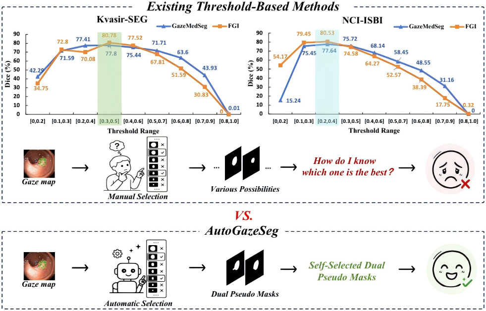
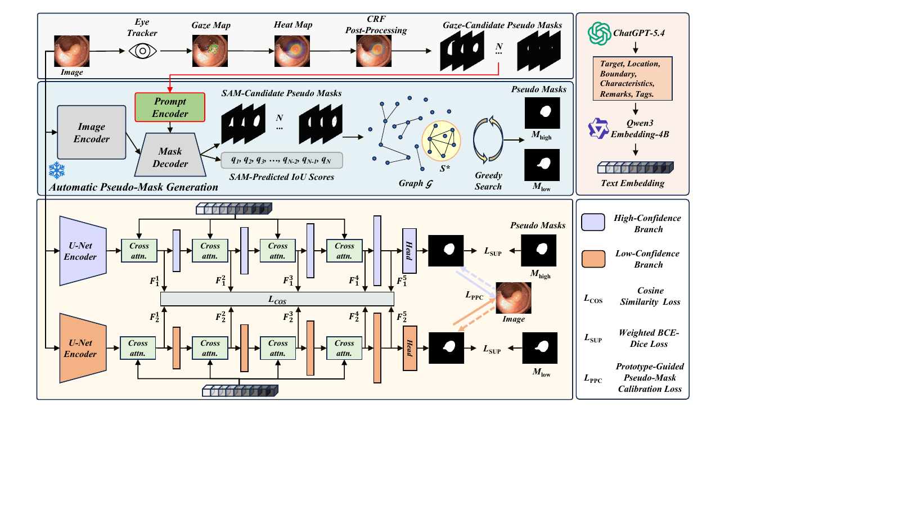
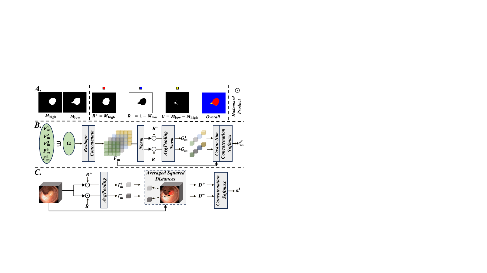
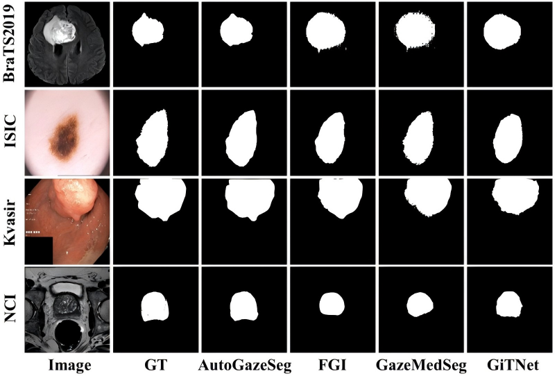

<div align="center">

# 👁️ AutoGazeSeg

### Advancing Gaze-Supervised Medical Image Segmentation with Automatic Pseudo-Mask Generation and Calibration

**Automatic pseudo masks · Prototype-guided calibration · Four medical benchmarks**

</div>

---

## ✨ Highlights

| 🎯 Automatic supervision | 🧩 Prototype calibration | 🔁 Reproducible workflow |
|:---:|:---:|:---:|
| Selects stable dual pseudo masks without a manually chosen response threshold | Calibrates ambiguous pixels with feature and image-appearance prototypes | Each dataset script performs training and then automatically evaluates the saved checkpoint |

- ✅ Kvasir-SEG, NCI-ISBI, ISIC, and BraTS 2019 are supported.
- ✅ Earlier AutoGazeSeg-compatible checkpoints load without state-dictionary conversion.
- ✅ Data paths, output paths, devices, seeds, and paper hyperparameters are configurable.



## 🧠 Method Overview

AutoGazeSeg learns from gaze-derived supervision through three connected stages.

### 1. 🎯 Automatic Pseudo-Mask Generation

CRF-refined gaze maps are sampled at multiple response levels and converted into box and point prompts for SAM. A level-stability graph combines candidate quality with inter-mask consistency. Greedy graph search selects a stable candidate family:

- the family intersection forms the high-confidence mask $M_{\mathrm{high}}$;
- family voting forms the low-confidence mask $M_{\mathrm{low}}$.

The two masks satisfy:

$$
M_{\mathrm{high}} \subseteq M_{\mathrm{low}}.
$$

### 2. 💬 Text-Guided Dual-Branch Segmentation

Target-aware text embeddings are injected into two U-Net branches through cross-attention. The high-confidence branch receives $M_{\mathrm{high}}$, while the low-confidence branch receives $M_{\mathrm{low}}$.

The direct supervision objective is:

$$
\mathcal{L}_{\mathrm{SUP}} = \mathcal{L}_{\mathrm{wbd}}\left(P_1, M_{\mathrm{high}}\right) + \mathcal{L}_{\mathrm{wbd}}\left(P_2, M_{\mathrm{low}}\right),
$$

where $\mathcal{L}_{\mathrm{wbd}}$ denotes weighted BCE-Dice loss.

### 3. 🧩 Prototype-Guided Pseudo-Mask Calibration

The dual masks partition each image into reliable foreground, reliable background, and an uncertain region:

$$
R^{+}=M_{\mathrm{high}},
\qquad
R^{-}=1-M_{\mathrm{low}},
\qquad
U=M_{\mathrm{low}}-M_{\mathrm{high}}.
$$

Feature prototypes and image-appearance prototypes estimate the foreground probability of each uncertain pixel:

$$
a_m=\left(1-\alpha\right)a_m^{F}+\alpha a^{I},\qquad\alpha=0.25.
$$

The calibrated soft pseudo mask for branch $m$ is:

$$
S_m=R^{+}+U a_m.
$$

Cross-branch calibration exchanges these soft masks:

$$
\mathcal{L}_{\mathrm{PPC}}=\mathcal{L}_{\mathrm{wbd}}\!\left(P_1,S_2\right)+\mathcal{L}_{\mathrm{wbd}}\!\left(P_2,S_1\right).
$$

The complete training objective is:

$$
\mathcal{L}_{\mathrm{total}}=\mathcal{L}_{\mathrm{SUP}}+\lambda_p\mathcal{L}_{\mathrm{PPC}}+\lambda_c\mathcal{L}_{\mathrm{COS}}.
$$

At inference, the foreground probabilities of the two branches are averaged:

$$
P=\frac{P_1+P_2}{2}.
$$





## 🔒 Anonymous Release

This package contains only the implementation required for the proposed method:

- no comparison-method source code;
- no author, affiliation, contact, or account information;
- no external badges, download URLs, or website references;
- no repository history or private experiment paths.

The four figures in `assets/` are local PNG files with identity-bearing metadata removed.

## 🗂️ Repository Scope

Each entry script trains one dataset and then evaluates its saved checkpoint.

| Dataset | Image type | Entry script |
|---|---|---|
| 🩺 Kvasir-SEG | Endoscopic images | `train_test_kvasir.sh` |
| 🧬 NCI-ISBI | Prostate MR images | `train_test_nci.sh` |
| 🔬 ISIC | Dermoscopic images | `train_test_isic.sh` |
| 🧠 BraTS 2019 | Brain MR images | `train_test_brats2019.sh` |

Pseudo-mask generation and text-description encoding are separate preparation stages. The training code expects the dual pseudo masks and text embeddings to be available before launch.

## ⚙️ Installation

Python 3.10 or newer and a CUDA-capable GPU are recommended.

```bash
python -m venv .venv
source .venv/bin/activate
python -m pip install --upgrade pip
python -m pip install -r requirements.txt
```

## 🧱 Prepared Data

### 📊 Paper Splits

| Dataset | Training split | Test split |
|---|---:|---:|
| Kvasir-SEG | 900 images | 100 images |
| NCI-ISBI | 60 volumes / 789 retained slices | 10 volumes / 117 retained slices |
| ISIC | 800 images | 200 images |
| BraTS 2019 | 4,495 slices | 878 slices |

### 📁 Directory Layout

The default paths are repository-relative. `train.txt` and `test.txt` contain one sample identifier per line.

```text
data/
└── <dataset>/
    ├── train.txt
    ├── test.txt
    ├── images/
    ├── masks/
    ├── embeddings/
    └── pseudo_masks/
        ├── labelshigh/
        └── labelslow/
```

Training samples require an image, text embedding, high-confidence mask, and low-confidence mask. Test samples require an image, text embedding, and ground-truth mask.

| Dataset | Image | Ground truth | M<sub>high</sub> | M<sub>low</sub> | Text embedding |
|---|---|---|---|---|---|
| Kvasir-SEG | `images/<id>.jpg` | `masks/<id>.jpg` | `labelshigh/<id>.jpg` | `labelslow/<id>.jpg` | `embeddings/<id>.npy` |
| NCI-ISBI | `images/<id>.dcm` | `masks/<id>.png` | `labelshigh/<id>.png` | `labelslow/<id>.png` | `embeddings/<id>.npy` |
| ISIC | `images/<id>.jpg` | `masks/<id>.png` | `labelshigh/<id>.jpg` | `labelslow/<id>.jpg` | `embeddings/<id>.npy` |
| BraTS 2019 | `images/<id>.png` | `masks/<id>.png` | `labelshigh/<id>.png` | `labelslow/<id>.png` | `embeddings/<id>.npy` |

Embedding arrays must contain the 2,560-dimensional token representations expected by the model. The high-confidence mask must be contained in the low-confidence mask.

Recreating the prepared inputs requires the SAM ViT-H weights used for pseudo-mask generation and the Qwen3-Embedding-4B weights used for text encoding. These weights are not distributed with this package.

## 🚀 Training and Evaluation

### ▶️ Train and Test

Each command processes one seed. Training is followed automatically by evaluation of the saved checkpoint.

```bash
SEED=0 DEVICE=0 bash train_test_kvasir.sh
SEED=0 DEVICE=0 bash train_test_nci.sh
SEED=0 DEVICE=0 bash train_test_isic.sh
SEED=0 DEVICE=0 bash train_test_brats2019.sh
```

The reported results use seeds `0`, `100`, and `10000`. Launch each seed separately:

```bash
SEED=0 DEVICE=0 bash train_test_nci.sh
SEED=100 DEVICE=0 bash train_test_nci.sh
SEED=10000 DEVICE=0 bash train_test_nci.sh
```

Prepared data may also be stored outside the repository:

```bash
DATA_ROOT=data/NCI-ISBI \
EMBEDDING_ROOT=data/NCI-ISBI/embeddings \
PSEUDO_HIGH_ROOT=data/NCI-ISBI/pseudo_masks/labelshigh \
PSEUDO_LOW_ROOT=data/NCI-ISBI/pseudo_masks/labelslow \
OUTPUT_ROOT=outputs \
SEED=0 \
DEVICE=0 \
bash train_test_nci.sh
```

### 🔎 Evaluation Only

Set `EVAL_ONLY=1` and provide a checkpoint:

```bash
EVAL_ONLY=1 \
CKPT_PATH=outputs/checkpoints/AutoGazeSeg_nci_seed0.pth \
SEED=0 \
DEVICE=0 \
bash train_test_nci.sh
```

Checkpoints produced by the earlier compatible implementation remain directly loadable through `CKPT_PATH`.

## 🎛️ Configuration

The four entry scripts already use the paper defaults. Expand the table only when a path or runtime setting needs to be overridden.

<details>
<summary><strong>Show all environment overrides</strong></summary>

<br>

| Variable | Purpose | Default |
|---|---|---|
| `PYTHON` | Python executable | `python` |
| `DATA_ROOT` | Dataset directory | `data/<dataset>` |
| `EMBEDDING_ROOT` | Precomputed text embeddings | `<DATA_ROOT>/embeddings` |
| `PSEUDO_HIGH_ROOT` | High-confidence pseudo masks | `<DATA_ROOT>/pseudo_masks/labelshigh` |
| `PSEUDO_LOW_ROOT` | Low-confidence pseudo masks | `<DATA_ROOT>/pseudo_masks/labelslow` |
| `OUTPUT_ROOT` | Common output directory | `outputs` |
| `RESULTS_DIR` | Predictions and metric tables | `<OUTPUT_ROOT>/results` |
| `LOG_DIR` | Training logs | `<OUTPUT_ROOT>/logs` |
| `CHECKPOINT_DIR` | Model checkpoints | `<OUTPUT_ROOT>/checkpoints` |
| `SEED` | Random seed | `0` |
| `DEVICE` | Visible CUDA device | `0` |
| `BATCH_SIZE` | Training batch size | `8` |
| `SPATIAL_SIZE` | Training and inference size | `224` |
| `DATA_SIZE_RATE` | Fraction of each split used | `1` |
| `MAX_ITE` | Training iterations | `15000` |
| `NUM_WORKERS` | Data-loader workers | `4` |
| `FP16` | Mixed precision switch | `1` |
| `VAL_STEP` | Validation interval | `100` |
| `LOG_STEP` | Logging interval | `100` |
| `PPC_WEIGHT` | Calibration weight λ<sub>p</sub> | `1.0` |
| `FEATURE_DISTILLATION_WEIGHT` | Feature-distillation weight λ<sub>c</sub> | `0.5` |
| `IMAGE_PROTO_BLEND` | Image-prototype blend α | `0.25` |
| `EVAL_ONLY` | Skip training and evaluate | `0` |
| `CKPT_PATH` | Evaluation checkpoint | Dataset/seed checkpoint |
| `SAVE_NAME` | Result subdirectory | `AutoGazeSeg_<dataset>_seed<SEED>` |

</details>

### 🧪 Paper Settings

| Setting | Value |
|---|---:|
| Training iterations | 15,000 |
| Batch size | 8 |
| Learning rate | 1×10<sup>−2</sup> → 1×10<sup>−4</sup> |
| Candidate interval δ | 0.01 |
| Node weight λ<sub>n</sub> | 0.4 |
| Edge weight λ<sub>e</sub> | 0.6 |
| Voting ratio ρ | 0.50 |
| Image-prototype blend α | 0.25 |
| Calibration weight λ<sub>p</sub> | 1.0 |
| Feature-distillation weight λ<sub>c</sub> | 0.5 |

## 📦 Outputs

```text
outputs/
├── checkpoints/
│   └── AutoGazeSeg_<dataset>_seed<seed>.pth
├── logs/
└── results/
    └── AutoGazeSeg_<dataset>_seed<seed>/
        ├── pred_png/
        ├── label_png/
        ├── per_case_metrics.csv
        └── summary_metrics.csv
```

## 📈 Results

Values are reported as mean ± standard deviation over three independent runs.

### 🩺 Kvasir-SEG and NCI-ISBI

| Method | Supervision | Kvasir-SEG Dice (%) | NCI-ISBI Dice (%) | Annotation time (hrs) |
|---|---|---:|---:|---:|
| UNet | Full | 82.12 ± 1.11 | 80.58 ± 0.48 | 18.7 |
| nnUNet | Full | 85.37 ± 0.48 | 81.54 ± 0.45 | 18.7 |
| BoxInst | Box | 65.72 ± 2.97 | 73.78 ± 1.15 | 3.1 |
| BoxTeacher | Box | 73.33 ± 1.30 | 75.60 ± 1.15 | 3.1 |
| PointSup | Point | 73.05 ± 1.64 | 73.46 ± 4.71 | 4.8 |
| AGMM | Point | 75.57 ± 0.84 | 73.86 ± 1.26 | 4.8 |
| AGMM | Scribble | 67.23 ± 1.02 | 72.70 ± 1.03 | 2.6 |
| CycleMix | Scribble | 76.43 ± 0.65 | 73.41 ± 1.09 | 2.6 |
| ShapePU | Scribble | 77.26 ± 0.73 | 73.06 ± 1.18 | 2.6 |
| ScribFormer | Scribble | 75.69 ± 0.48 | 74.31 ± 1.29 | 2.6 |
| TransUNet | Gaze | 70.38 ± 0.86 | 75.46 ± 1.20 | 2.2 |
| UNet | Gaze | 73.74 ± 0.94 | 74.75 ± 1.58 | 2.2 |
| nnUNet | Gaze | 74.42 ± 0.92 | 77.20 ± 1.03 | 2.2 |
| GazeMedSeg | Gaze | 77.80 ± 1.02 | 77.64 ± 0.57 | 2.2 |
| GiTNet | Gaze | 76.86 ± 0.23 | 78.98 ± 0.04 | 2.2 |
| FGI | Gaze | 80.78 ± 0.11 | 80.53 ± 0.49 | 2.2 |
| **AutoGazeSeg** | **Gaze** | **86.94 ± 0.09** | **82.31 ± 0.10** | **2.2** |

### 🔬 ISIC

| Method | Supervision | Dice (%) | IoU (%) | HD95 |
|---|---|---:|---:|---:|
| UNet | Full | 88.17 ± 0.10 | 80.97 ± 0.05 | 7.96 ± 0.34 |
| nnUNet | Full | 88.96 ± 0.18 | 81.98 ± 0.29 | 7.70 ± 0.20 |
| UNet | Gaze | 82.95 ± 0.45 | 73.28 ± 0.61 | 11.65 ± 0.37 |
| TransUNet | Gaze | 80.05 ± 0.67 | 69.61 ± 0.78 | 13.90 ± 0.27 |
| nnUNet | Gaze | 82.27 ± 0.50 | 72.38 ± 0.70 | 11.87 ± 0.14 |
| GiTNet | Gaze | 77.86 ± 0.29 | 66.49 ± 0.42 | 12.03 ± 0.13 |
| GazeMedSeg | Gaze | 82.91 ± 0.02 | 73.38 ± 0.07 | 10.35 ± 0.47 |
| FGI | Gaze | 84.22 ± 0.17 | 75.10 ± 0.21 | 10.76 ± 0.44 |
| **AutoGazeSeg** | **Gaze** | **87.59 ± 0.51** | **79.72 ± 0.76** | **8.14 ± 0.28** |

### 🧠 BraTS 2019

| Method | Supervision | Dice (%) | IoU (%) | HD95 |
|---|---|---:|---:|---:|
| UNet | Full | 91.52 ± 0.28 | 84.89 ± 0.43 | 8.48 ± 0.54 |
| nnUNet | Full | 91.85 ± 0.06 | 85.39 ± 0.10 | 8.99 ± 0.14 |
| UNet | Gaze | 68.42 ± 0.40 | 52.86 ± 0.70 | 21.87 ± 0.14 |
| TransUNet | Gaze | 67.56 ± 0.10 | 51.48 ± 0.18 | 21.50 ± 0.37 |
| nnUNet | Gaze | 67.24 ± 0.37 | 51.19 ± 0.40 | 22.23 ± 0.51 |
| GiTNet | Gaze | 77.84 ± 0.16 | 65.06 ± 0.25 | 17.61 ± 0.48 |
| GazeMedSeg | Gaze | 79.96 ± 0.68 | 67.82 ± 0.86 | 14.49 ± 0.56 |
| FGI | Gaze | 77.98 ± 2.26 | 64.95 ± 3.08 | 20.02 ± 0.79 |
| **AutoGazeSeg** | **Gaze** | **86.17 ± 0.26** | **76.83 ± 0.44** | **12.10 ± 0.54** |

### 🧪 Component Ablation

| Variant | Kvasir-SEG Dice (%) | NCI-ISBI Dice (%) |
|---|---:|---:|
| CRF | 41.17 ± 0.10 | 32.56 ± 0.15 |
| Single-SAM at ℓ = 0.35 | 81.38 ± 0.36 | 78.29 ± 0.73 |
| Automatic pseudo-mask generation | 84.50 ± 0.76 | 80.47 ± 0.86 |
| Generation + feature prototype | 85.56 ± 0.05 | 81.46 ± 0.34 |
| Generation + image prototype | 85.67 ± 0.25 | 81.52 ± 0.24 |
| Generation + prototype calibration | 86.01 ± 0.18 | 81.70 ± 0.11 |
| **Full model** | **86.94 ± 0.09** | **82.31 ± 0.10** |

### 🖼️ Qualitative Comparison


